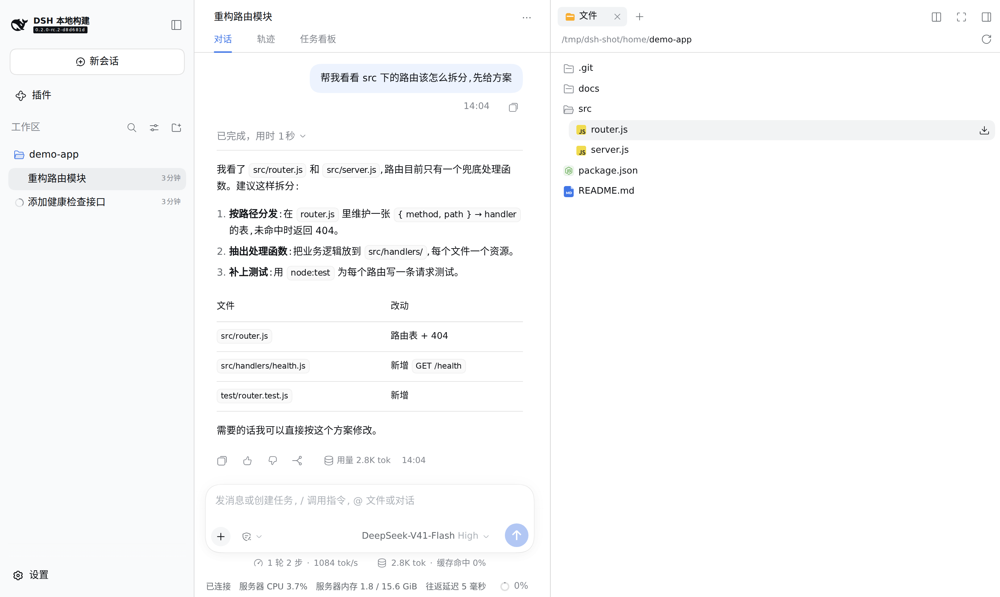
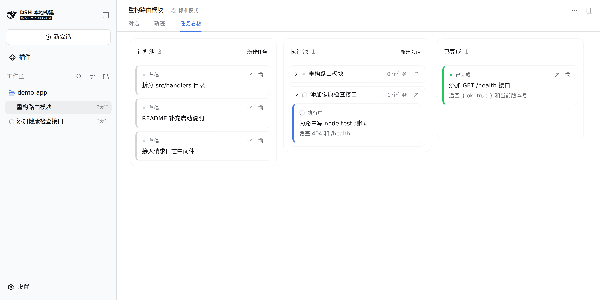
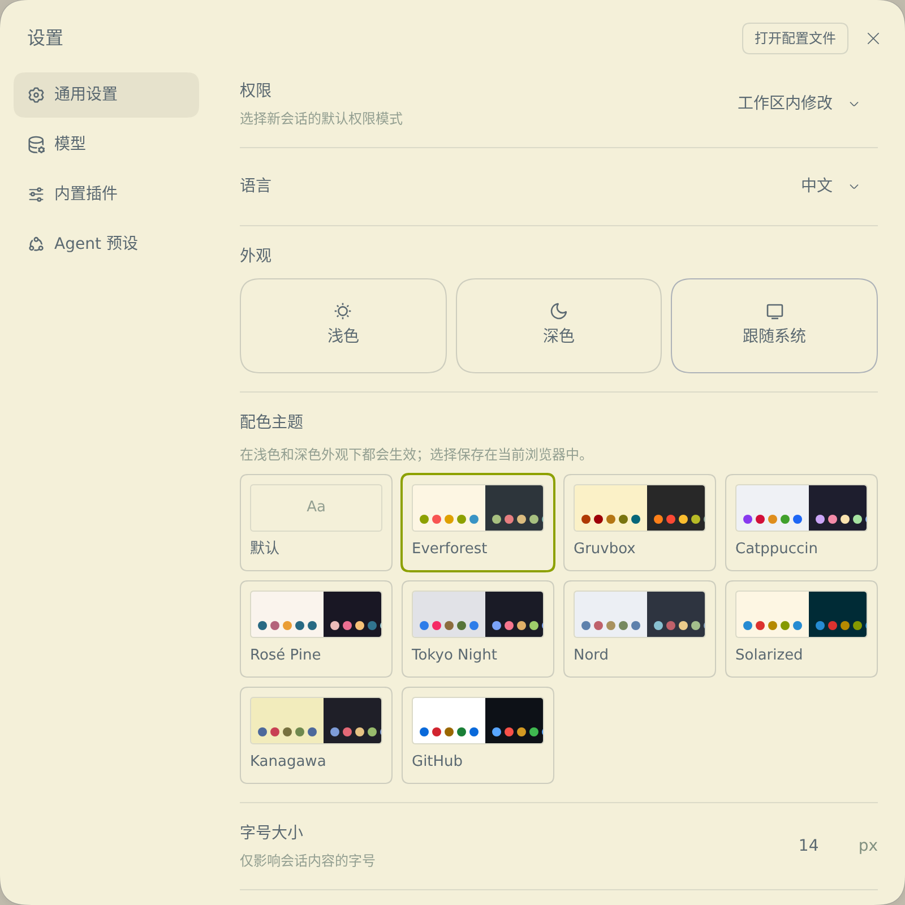
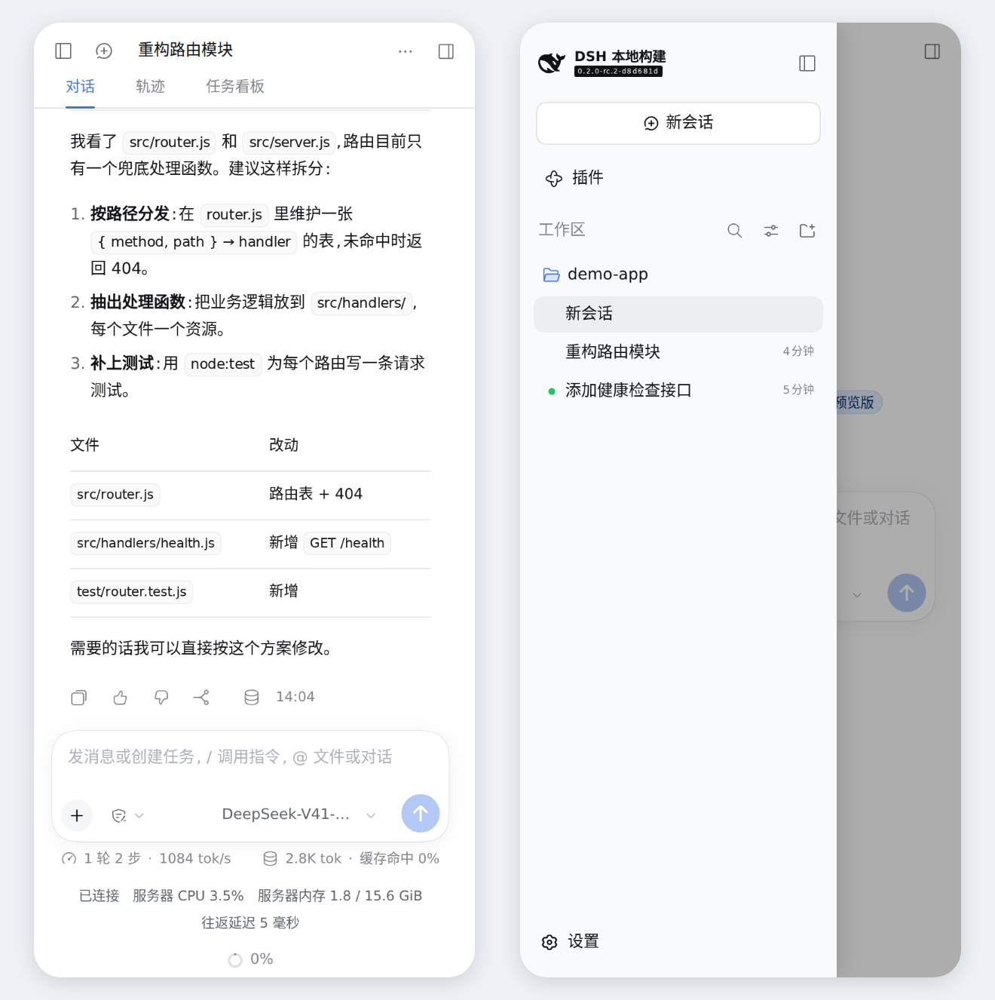
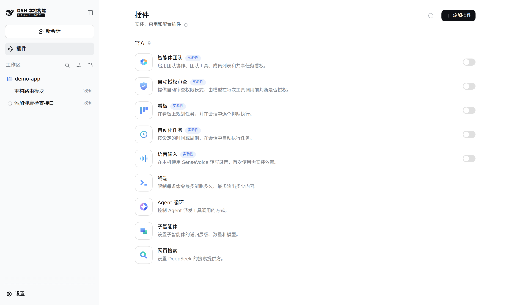

# DeepSeek Harness Pro

English | [中文](README.zh.md)

DeepSeek Harness Pro (DSH Pro) is an enhanced distribution of [DeepSeek Harness](https://github.com/deepseek-ai/deepseek-harness) (`dsh`), the open-source agent harness by DeepSeek AI. It keeps every official feature and adds a Kanban task board, a server status footer, a phone layout, workspace file downloads, model-native web search, and faster remote loading, and it ships **DSH Remote** for running dsh on your own server and using it from a Mac client, a browser, or a phone.

DSH Pro is unofficial: DeepSeek does not develop, endorse, or support it. Report DSH Pro problems at [JoshuaNibaba/dsh-pro](https://github.com/JoshuaNibaba/dsh-pro/issues), not in the official repository.



## Contents

- [Highlights](#highlights)
- [Run](#run)
- [Deploy to a server](#deploy-to-a-server)
- [Improvements over DeepSeek Harness](#improvements-over-deepseek-harness)
- [Added plugins](#added-plugins)
- [Update](#update)
- [Releases and branches](#releases-and-branches)
- [Compatibility](#compatibility)
- [About DeepSeek Harness](#about-deepseek-harness)
- [License](#license)

## Highlights

- **Kanban task board**: plan tasks per Workspace and let each Session work through its lane one task at a time.
- **Color themes**: Everforest by default, with eight more editor schemes in General Settings.
- **Remote use**: DSH Remote installs dsh as a service with a password gateway and HTTPS; a native Mac client, a browser, or a phone connects to it.
- **Server status footer**: connection state, server CPU and memory, and RPC latency under the composer.
- **Phone layout**: a sidebar drawer and home-screen launcher icons for phone browsers.
- **Workspace file downloads** from the right-sidebar file tree.
- **Model-native web search** through the current model's own search tool, as in Claude Code.
- **Faster remote loading**: WebSocket compression, paged history, immutable asset caching, and an automatic reload after a server update.

## Run

DeepSeek Harness is in _developer preview_ and DSH Pro follows its releases, so compatibility-breaking changes will happen. Review the [safety notice](SAFETY.md) before running the project.

### Run from source

You need Node.js `^22.19` or `>=24` and git. Corepack selects the pnpm version declared by the repository; Node.js 25 and later do not bundle it, so install it when missing.

```sh
git clone https://github.com/JoshuaNibaba/dsh-pro.git
cd dsh-pro
command -v corepack >/dev/null || npm install --global corepack
corepack enable
pnpm install
pnpm run build
pnpm dsh web
```

`pnpm run build` prepares the repository artifacts, and `pnpm dsh web` starts the Web UI from them, prints its address, and opens it in the default browser; pass `--no-open` to skip the browser. On first use, enter a DeepSeek API key when prompted, or add another model provider (Anthropic, OpenAI, and others) under Settings → Models. See the [Web UI guide](docs/user/guide/index.md).

Packages keep their official `@deepseek-ai/*` names and are not published to npm. Every added plugin below is part of this build and needs no separate installation.

## Deploy to a server

The [`remote/`](remote/README.md) directory is DSH Remote:

| Part | Purpose |
|---|---|
| [Server installer](remote/server/install.sh) | Installs Node.js 22 and the `dsh-web` systemd service (listening on `127.0.0.1` only) on Debian/Ubuntu; with `--domain` it also sets up a password login gateway, nginx, and an HTTPS certificate so browsers and phones can connect |
| Mac client `DSH Remote.app` | Native macOS app: enter the web address and access password, or use an SSH tunnel; updates itself. The built app is in [release `dsh-remote`](https://github.com/JoshuaNibaba/dsh-pro/releases/tag/dsh-remote) |
| [`dsh-remote` CLI](remote/cli/dsh-remote) | Optional terminal tool: open a tunnel, read logs, restart the service, update the Mac client |

On the server, as root:

```sh
git clone https://github.com/JoshuaNibaba/dsh-pro.git /opt/dsh-pro-src
bash /opt/dsh-pro-src/remote/server/install.sh --domain dsh.example.com
```

Without a clone, `curl -fsSL https://raw.githubusercontent.com/JoshuaNibaba/dsh-pro/main/remote/server/install.sh | bash -s -- --domain dsh.example.com` does the same. The installer first installs and starts the official dsh from npm, then prints the web address and the generated access password. Then switch the service to DSH Pro:

```sh
command -v corepack >/dev/null || npm install --global corepack
corepack enable
sudo -iu dsh
git clone https://github.com/JoshuaNibaba/dsh-pro.git ~/dsh-pro
cd ~/dsh-pro && pnpm install && pnpm run build
ln -sfn ~/dsh-pro/apps/cli/lib/bin.js ~/.dsh-remote/dsh-bin
sudo systemctl restart dsh-web
```

The Corepack setup commands run as root and provide pnpm for every user; the remaining commands run as the `dsh` user. While `~/.dsh-remote/dsh-bin` exists, the service runs the dsh it points to; remove the link and restart to return to the official npm release.

To show Host settings when connecting through a domain, explicitly list its HTTPS authority in `privilegedHosts` as described in [Remote Host settings](remote/README.md#remote-host-settings). `--trusted-host` allows connections but does not enable those settings.

On the Mac, download `DSH-Remote.zip` from [release `dsh-remote`](https://github.com/JoshuaNibaba/dsh-pro/releases/tag/dsh-remote), unzip it, and drag `DSH Remote.app` into Applications; the first time, right-click it and choose Open (the app is not notarized by Apple). Or install it from the command line:

```sh
curl -fsSL https://github.com/JoshuaNibaba/dsh-pro/releases/download/dsh-remote/DSH-Remote.zip -o /tmp/DSH-Remote.zip
ditto -x -k /tmp/DSH-Remote.zip ~/Applications
```

On first launch, enter the web address and access password. [remote/README.md](remote/README.md) covers SSH mode, HTTPS options, Cloudflare, the service menu, and troubleshooting.

## Improvements over DeepSeek Harness

### Kanban task board

Kanban is switched on in a new Web profile (the Plugins page can switch it off), and every started Session gets a **Kanban** tab beside Chat and Trajectory. The board of the Session's Workspace has three columns: a plan pool, one lane per Session, and completed tasks. Drag a planned card into a Session's lane and the Kanban service sends the lane's tasks one at a time while that Session is idle, then marks each task completed or failed from the end reason of its Turn; a failure pauses the lane and offers retry, skip, and withdraw. Unsent tasks stay editable, movable, and withdrawable.



### Server status footer

The footer under the composer shows the connection state, server CPU, server memory, and RPC round-trip latency (bottom of the first screenshot), so a remote user can tell a busy server from a slow network or a dropped connection. It is on by default; to hide it, add these lines to the Web profile's `~/.dsh/profiles/web/cordis.patch.yml` and restart dsh:

```yaml
- id: ui-server-status
  disabled: true
```

### Color themes

The Web UI starts in Everforest. **Settings → General → Color theme** switches among Everforest, Gruvbox, Catppuccin, Rosé Pine, Tokyo Night, Nord, Solarized, Kanagawa, and GitHub, or returns to the built-in palette with **Default**. Each scheme has a light and a dark palette, so the Appearance row still picks light, dark, or system, and every surface follows the scheme, including the welcome dialog. The choice is saved per browser.



### Workspace file downloads

In the right sidebar's Files tree, hovering a file shows a download button that saves the server-side workspace file to your computer (right side of the first screenshot).

### Phone layout

Below 768px wide, the left sidebar becomes a drawer and the conversation and composer fill the screen. The Web app provides PNG launcher icons, so a phone browser can add it to the home screen.



### Model-native web search

The `web_search` tool defaults to the search built into the current Session's model (Anthropic `web_search_20250305`; `web_search` for OpenAI, Azure, and Codex Responses), as Claude Code's WebSearch does; DeepSeek models keep DeepSeek's official search. Each search records a `web/model-search-request` Session event.

### First-run welcome

The first time a browser opens DSH Pro, a paged welcome dialog walks through these highlights with short animations, including a card being dragged across the Kanban board. Next and Back page through it, and Skip closes it at any point.

### Remote connection and load time

| Improvement | Behavior |
|---|---|
| WebSocket compression | The live stream negotiates permessage-deflate, which cuts traffic over CDNs and long-haul links. The gateway `websocketCompression: false` setting turns it off |
| Paged history | Opening a Session loads at most the latest 40 messages or three Turns, and the next older page loads automatically near the top, so long Sessions open faster |
| Immutable asset caching | Content-hashed files under `assets/` are served with `Cache-Control: public, max-age=31536000, immutable`, so reopening the page does not download the frontend again |
| Reload after a server update | A page that reconnects to a server restarted with other client bundles reloads itself instead of going blank |

### Models and tools

| Improvement | Behavior |
|---|---|
| pi-ai 1.1.0 | `@earendil-works/pi-ai` is upgraded to 1.1.0. Anthropic models receive mid-conversation tool changes natively instead of a rewritten cached context; set `compat.supportsMidConvoToolChanges: false` for gateways that strip that beta |
| Batched tool calls | `batchIndependentCalls: true` on the `tools` plugin asks the model in the system prompt to request independent tool calls together in one response |
| Stable source path | `sourceRoot` on the `web-runtime` plugin fixes the source path in the system prompt, so prompt caches stay valid when the service switches between two release directories |
| Sandbox mode compatibility | A tool call that repeats the current sandbox mode with a blank justification (common with GPT models) is accepted; only a wider mode needs a justification |
| Composer only beside Chat | Views such as Trajectory and Kanban render without the composer |

## Added plugins

All of these are built with DSH Pro; none needs installation, and all are on in a new deployment.

| Plugin | Package | How to turn it off |
|---|---|---|
| Kanban | `@deepseek-ai/dsh-experimental-kanban-bundle` (with `dsh-experimental-kanban` and `dsh-experimental-client-ui-kanban`) | Switch off Kanban on the Plugins page, shown below |
| Color themes | `@deepseek-ai/dsh-client-ui-theme-pack` | Choose **Default** under Settings → General → Color theme |
| Server status footer | `@deepseek-ai/dsh-client-ui-server-status` | Set `disabled: true` in `cordis.patch.yml`, as above |
| Model-native search | `@deepseek-ai/dsh-web-search-model` | — |
| File downloads, phone layout, paged history, and the rest | Changes to official plugins | — |



## Update

```sh
cd dsh-pro
git pull --ff-only
pnpm install
pnpm run build
```

Run `pnpm run clean` first when the official base version changed. On a server, run the same commands as the `dsh` user in `~/dsh-pro`, then `sudo systemctl restart dsh-web`. The Mac client checks [release `dsh-remote`](https://github.com/JoshuaNibaba/dsh-pro/releases/tag/dsh-remote) by itself and offers updates.

## Releases and branches

| Name | Content |
|---|---|
| `main` branch | The default branch: an official release tag (`dsh-v*`) with the DSH Pro commits on top. Official releases are merged into it and its history is never rewritten, so a clone can always fast-forward |
| `master` branch | A copy of the official `master` with no DSH Pro changes |
| `dsh-pro-v<official version>.<n>` tags | Published DSH Pro versions, each with a [GitHub Release](https://github.com/JoshuaNibaba/dsh-pro/releases); `dsh-pro-v0.2.0-rc.2.1` is the first DSH Pro version on official `dsh-v0.2.0-rc.2` |
| `dsh-remote` release | The latest Mac client, rebuilt by [GitHub Actions](.github/workflows/dsh-remote-mac.yml) whenever `remote/mac/` changes |

`git log --no-merges <official tag>..main` lists every DSH Pro change.

[DSH Pro CI](.github/workflows/dsh-pro-ci.yml) checks `main` pushes, pull requests, and Pro release tags on GitHub-hosted runners. It runs types, lint, documentation and package constraints, Pro regression tests on Linux (Node 22.19 and 24) and Windows (Node 24), and a built-browser smoke test. `Pro checks passed` requires all jobs to succeed. This workflow does not publish npm packages; the upstream coverage and broader platform workflows remain separate.

## Compatibility

Sessions that ran model-native web search contain `web/model-search-request` events. Official builds without this change refuse to open those Sessions, so switching back to the official release does not restore access to them.

## About DeepSeek Harness

[DeepSeek Harness](https://github.com/deepseek-ai/deepseek-harness) is the open-source agent harness developed by [DeepSeek AI](https://deepseek.com). It is built on an **everything-is-a-plugin** architecture powered by [Cordis](https://github.com/cordiverse/cordis), described in [_A Programming Paradigm for Spatiotemporal Composability_](https://arxiv.org/abs/2608.25512). DSH Pro inherits all of its features; the official [README](https://github.com/deepseek-ai/deepseek-harness#readme) and [documentation](https://deepseek-harness.github.io/deepseek-harness/) describe them.

Development documentation in this repository applies to DSH Pro as well: start with the [development guide](docs/development.md) and [architecture documentation](docs/architecture.md); agents follow [AGENTS.md](AGENTS.md), and [CONTRIBUTING.md](CONTRIBUTING.md) describes the official contribution process. Feedback about DeepSeek Harness itself goes to its [GitHub Discussions](https://github.com/deepseek-ai/deepseek-harness/discussions) and [Discord community](https://discord.gg/4MrtZUhpxg).

## License

DSH Pro keeps the official [MIT License](LICENSE) and copyright notice. Third-party dependencies and their licenses are disclosed in [THIRD_PARTY_NOTICES.md](THIRD_PARTY_NOTICES.md). "DeepSeek Harness" is a trademark of DeepSeek; see the [brand guidelines](BRAND_GUIDELINES.md).
